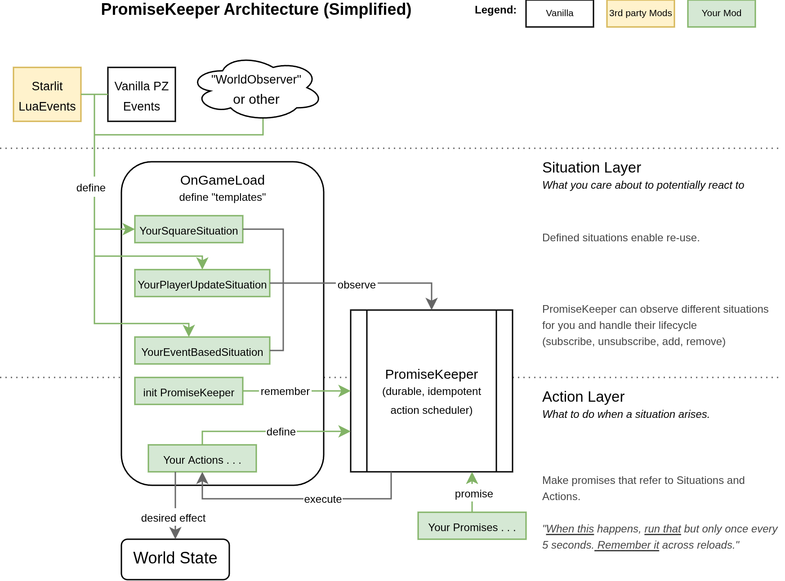

# PromiseKeeper

*A stateful situation-to-action orchestration library for **Project Zomboid (Build 42)*** - part of the [DREAM](https://github.com/christophstrasen/DREAM) family.

> It listens for situations from your sources (WorldObserver streams or event emitters), runs actions according to your rules, and remembers progress across reloads.

[](https://github.com/christophstrasen/PromiseKeeper/actions/workflows/ci.yml)

---

[Steam Workshop → [42SP] PromiseKeeper](TBDLink)

---

## Who is this for?

PromiseKeeper is for modders who:
- can write `Events.*` handlers, but don’t want to hand-roll persistence + “only once” logic,
- want a clean separation of concerns between **sensing** (finding situations) and **acting** (mutating game state),
- want deterministic, debuggable behavior (`whyNot`, retries, cooldown, chance).

## When to use it (and when not)

Use PromiseKeeper when you need:
- “run this action once per <player/square/zombie/...>, even after reload”.
- a small policy surface (max runs, deterministic chance, cooldown, retry delay).
- to pair **WorldObserver** (sensing) with persisted actions.

Don’t use it when:
- Your logic is purely local and ephemeral (no persistence needed; a direct event handler is enough).
- You don't like "framework-y" or declarative coding conventions.
- You need tested multiplayer guarantees.

---

## Quickstart

Copy/paste into the Project Zomboid debug console (in-game):

```lua
local PromiseKeeper = require("PromiseKeeper")
local pk = PromiseKeeper.namespace("MyMod")

-- 1) Define a situation (events need a mapper to provide occurranceKey + subject)
pk.situations.defineFromPZEvent("onTickPlayer", Events.OnTick, function(_args)
  local player = getPlayer()
  return {
    occurranceKey = "player:" .. tostring(player:getPlayerNum() or 0),
    subject = player,
  }
end)

-- 2) Define an action
pk.actions.define("logTick", function(subject, _actionArgs, promiseCtx)
  print(("[PK] tick occurranceKey=%s subject=%s"):format(
    tostring(promiseCtx.occurranceKey),
    tostring(subject)
  ))
end)

-- 3) Declare a promise (this stores the definition and starts listening immediately)
promise = pk.promise({
  promiseId = "logTickOnce",
  situationKey = "onTickPlayer",
  actionId = "logTick",
  policy = { maxRuns = 1, chance = 1 },
})
```

To resume stored promises after reload, register situations + actions at game startup and call:

```lua
pk.remember()
```

---

## Overview



## Mental model (the “when this, then that” part)

PromiseKeeper is a persistent rule runner:

- You define a **situation** (`situationKey`) that emits occurrences (each with an `occurranceKey`).
- You define an **action** (`actionId`) that runs on the occurrence `subject`.
- You declare a **promise** (`promiseId`) that ties situation → action with a **policy** (chance, cooldown,
  retries, max runs).

Policy decisions are deterministic by default: `chance` is deterministic per (`namespace`, `promiseId`, `occurranceKey`) so the same occurrence does not re-roll each time it is observed.

More detail: [Mental model](docs/concepts/mental_model.md) and [IDs](docs/concepts/ids.md).

---

## Documentation

User docs:
- [Docs index](docs/index.md) (start here)
- [Quickstart](docs/quickstart.md)
- [API reference](docs/reference/api.md)

Internal docs (implementation notes, not a stable learning path):
- [Vision](docs_internal/vision.md)
- [Architecture](docs_internal/architecture.md)
- [API notes](docs_internal/api.md)
- [Project history](docs_internal/project_history.md)

## What’s neat or at least unique about PromiseKeeper

- **Persistence + idempotence:** remembers progress per `occurranceKey` across reloads.
- **Deterministic policy:** chance is deterministic per key (no re-rolls), cooldown is per promise.
- **It’s reactive:** PromiseKeeper doesn’t poll or scan. It runs as soon as your situation source emits, for events that means in the same tick the event has been emitted.
- **Debuggable:** Broken promises keep a reason via `whyNot`.
- **Light on world logic:** PromiseKeeper does not probe/scan; it only runs actions when situations arrive.
- **Plays well with WorldObserver:** treat WO situations as already actionable (subject = the full observation).

## Contributing

See [contributing.md](contributing.md) and [developing.md](docs_internal/developing.md).

## AI disclosure

Parts of this project (docs and code) were developed with AI assistance. Please treat the repository as the source of truth, and report unclear docs or surprising behavior as issues.

## Disclaimer

This is an early project. Expect API changes and sharp edges.

PromiseKeeper is not affiliated with The Indie Stone. Project Zomboid is a trademark of The Indie Stone.

## License

MIT (see [LICENSE](LICENSE)).
